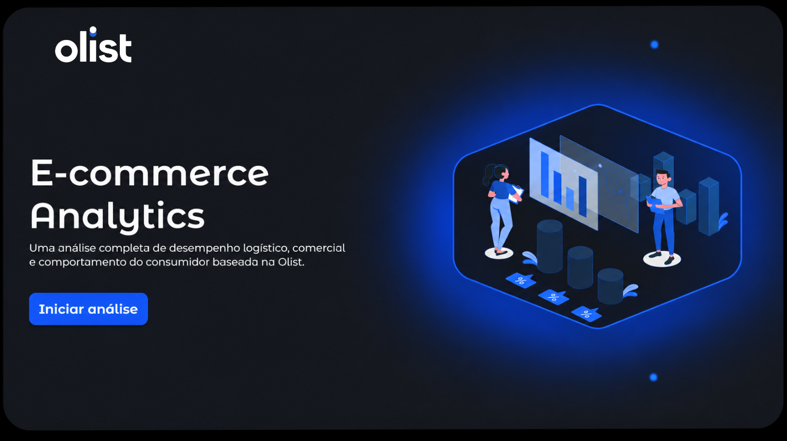
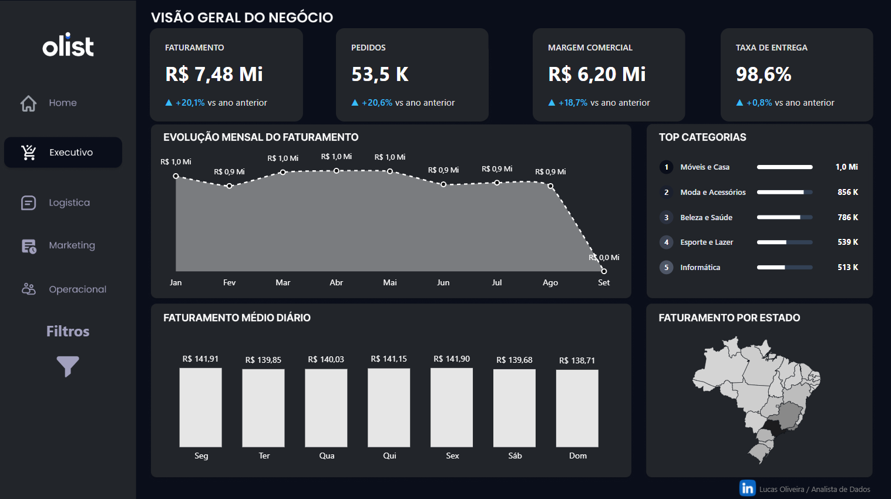
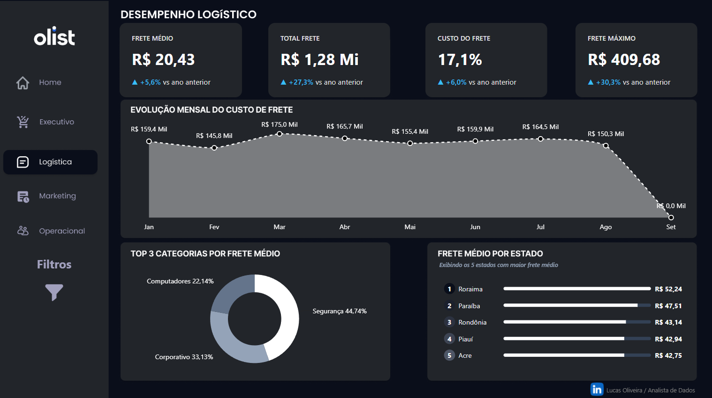
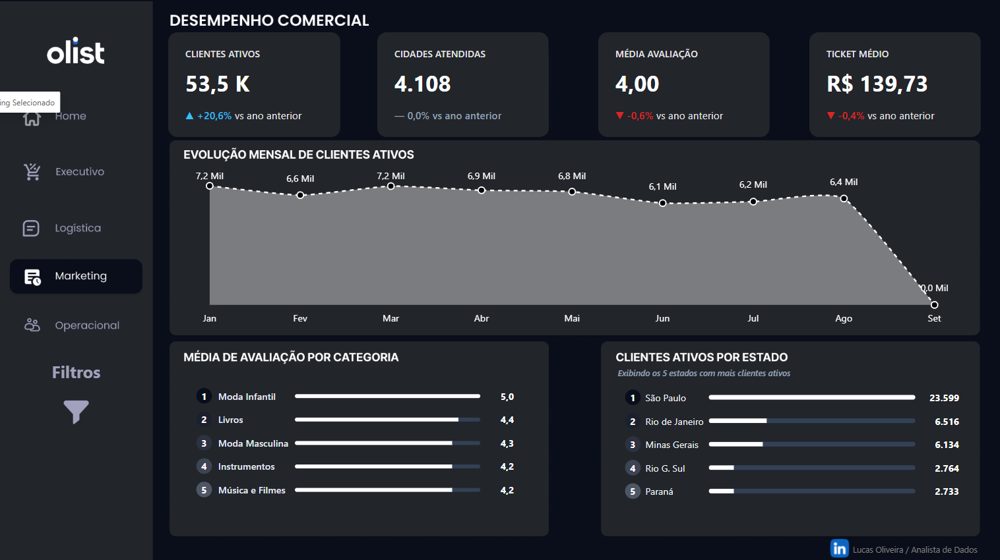
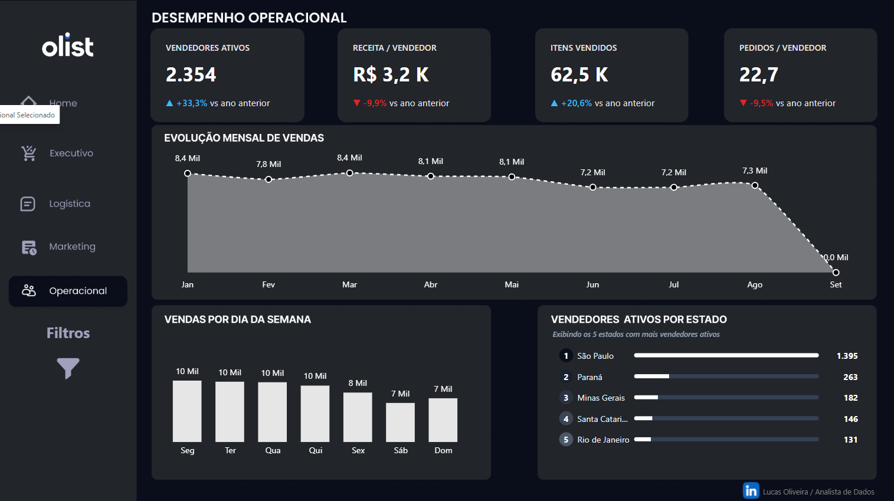

# 🛒 Olist E-commerce Analytics | BigQuery & Power BI

## 🔗 Acesso ao Dashboard
👉 **[Clique aqui para acessar o Dashboard no Power BI Service](https://app.powerbi.com/links/9sv8R_NIKD?ctid=b1f41013-e445-4b35-a708-06a99e6ced6e&pbi_source=linkShare&bookmarkGuid=343ab303-e086-4b40-88fc-fc9230f94b05)**

---

## 📌 Sobre o Projeto
Este projeto de portfólio apresenta uma solução completa de análise de dados ponta a ponta, utilizando o dataset público da **Olist**. O objetivo principal foi transformar dados brutos em insights acionáveis, cobrindo as áreas executiva, logística, de marketing e operacional da empresa.

Toda a arquitetura de dados foi construída utilizando **Google BigQuery** para o Data Warehousing e processamento em nuvem, e **Power BI** para a visualização de dados, storytelling e criação de uma interface rica e interativa.

---

## 🏗 Arquitetura de Dados e Modelagem no BigQuery
Para otimizar a performance do Power BI e centralizar as regras de negócio diretamente no Data Warehouse, a transformação dos dados (ELT) foi estruturada em duas etapas estratégicas utilizando Views SQL:

1. **`view_vendas_limpas` (Camada de Tratamento):**
   * Responsável pelo processo de limpeza dos dados brutos.
   * Tratamento de valores nulos, conversão correta de tipos de dados e padronização de campos.

2. **`view_vendas_consolidada` (Camada de Negócio / Consumo):**
   * View final que consome os dados já tratados da etapa anterior.
   * Realiza os cruzamentos (JOINS) necessários entre as entidades (Clientes, Pedidos, Itens, Vendedores e Pagamentos) para gerar uma tabela consolidada, servindo como a base principal para o consumo do Power BI.

---

## 🛠 Tecnologias e Ferramentas Utilizadas
* **Google BigQuery:** Armazenamento em nuvem, manipulação de dados e modelagem (SQL).
* **Power BI:** Conexão com o BigQuery, modelagem relacional, cálculos avançados (DAX), design de UI/UX e visualização de dados.
* **Figma:** Criação de layouts, backgrounds e prototipagem da interface.

---

## 📊 Estrutura do Dashboard
O relatório foi desenhado com foco na experiência do usuário (UX), simulando a navegação de uma aplicação web real.

### Visão Geral das Páginas

| Executivo | Logística | Marketing | Operacional |
| :---: | :---: | :---: | :---: |
|  |  |  |  |

---

## 💡 Funcionalidades e UX/UI Aplicadas
Para garantir uma navegação fluida e análises precisas, as seguintes funcionalidades foram implementadas no Power BI:

* **Menu de Navegação Lateral:** Barra fixa à esquerda para transição rápida entre as 5 páginas.
* **Painel de Filtros Global Retrátil:** O painel de filtros foi desenvolvido para funcionar de forma **persistente em todas as páginas do projeto**. Ao expandir o painel, você pode aplicar segmentações que mantêm o contexto de análise enquanto navega entre as visões Executiva, Logística, Marketing e Operacional.

| Visão Padrão (Executivo) | Visão com Filtros Ativos (Funciona em todas as abas) |
| :---: | :---: |
|  |  |

* **Segmentações Disponíveis:** Filtros de Ano, Estado, Período Semanal (Fim de semana/Dia útil) e Região.
* **Gestão de Filtros:** Botões dedicados para limpar todas as seleções instantaneamente e para recolher o painel de forma suave, otimizando o espaço da tela.

---
*Desenvolvido por Lucas Oliveira* | [Acesse meu LinkedIn](https://www.linkedin.com/in/lucas-santos-social/)
